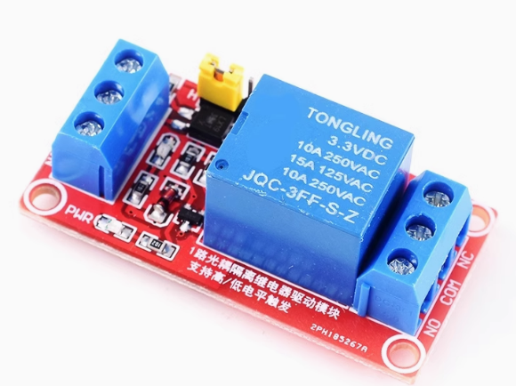
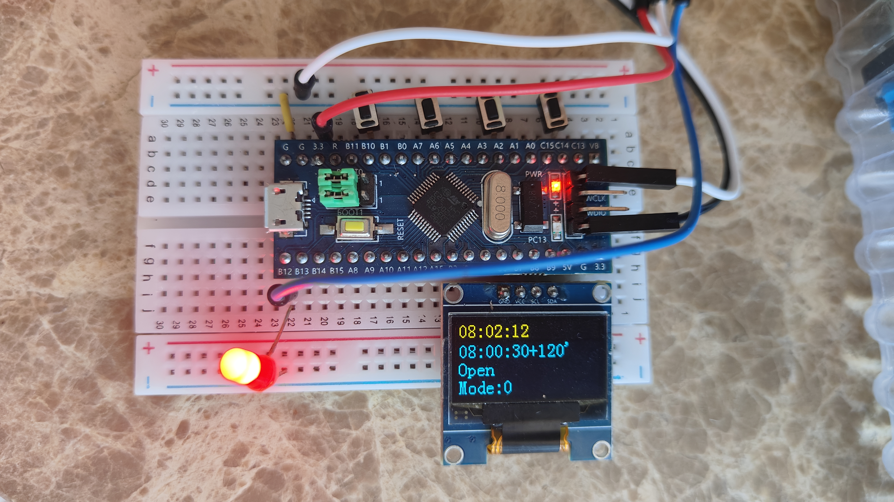

# Aumatic Watering System

This is  Watering System using stm32 MCU to aumaticcally watering the plants by setting the start time and duration

## Features:

- Clock built by Timer count function
- Automatic Watering built by Timer interupt function
- Support Clock/Watering_time/durition settings

## TODO:

- Support more power pumpy to more plants
- Support more settings for watering time
- build a circult with MCU, power, relay etc
- 土壤湿度检测模块[TODO]

# Hardware

## Automatic Switch

- STM32F103C8 as controller
- Relay(3.3v): send gpio high/low volt to open/close the relay, then control the pump
- Breadboard

## Watering System V1

- Pump:  peristaltic pump 蠕动泵, 流量精确，几乎静音，但是压力和流量都很小 
- Power: DV 12V 
- DC-DC 电压转换模块： 12V转3.3V/5V/12V- 800ma
- 滴箭/软管:  水流无法控制

## Watering Systme V2[TODO]

image from Reference[1]

- Pump: diaphragm pump, if you want to support more plants, 1
- Power:  12V/24V, about 40W
- 2分PE管
- 2分快接弯头，10
- 2分快三通头，10  
- 2分球阀，10
- 进水过滤头， 1

# Software

## Clock : show/set the clock

with the conter function of timer, it support automatic timing with timer counting

## Clock/Watering_time/duration sets:

- start_time: set the starting time
- duration:  set the duration for watering

## Automatic Watering by Timer interupt

with the function of timer interupt, it support automatic watering with interuption

# Reference

[懒人是如何养几百种植物的，当然是自动浇水](https://www.bilibili.com/video/BV1XB42167x3/?spm_id_from=333.337.search-card.all.click&vd_source=b3d4057adb36b9b243dc8d7a6fc41295)
[Plant Watering Robot with a Raspberry Pi](https://docs.viam.com/tutorials/projects/make-a-plant-watering-robot/)
[基于树莓派的远程控制自动浇花装置（一）总体架构及硬件设计](https://www.bilibili.com/read/cv19718999/)
[3种自动浇花方案 DIY、解放双手托管你的花花草草](https://zhuanlan.zhihu.com/p/225813647)